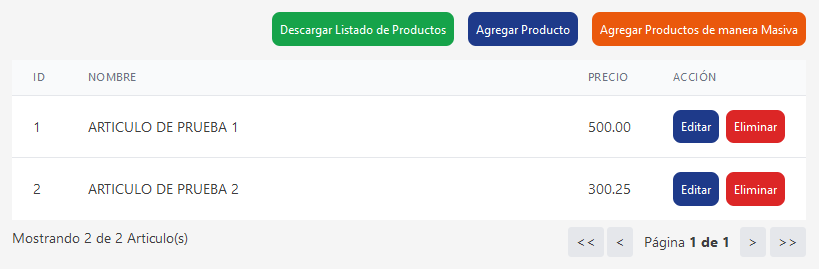
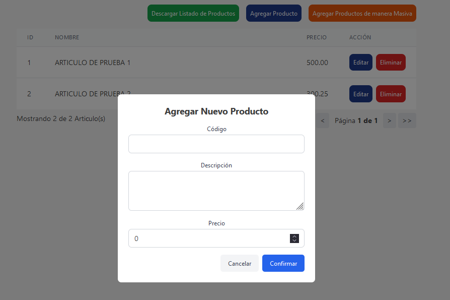
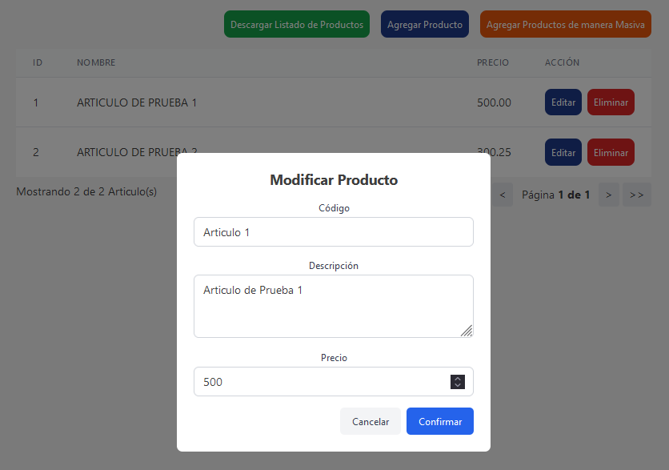
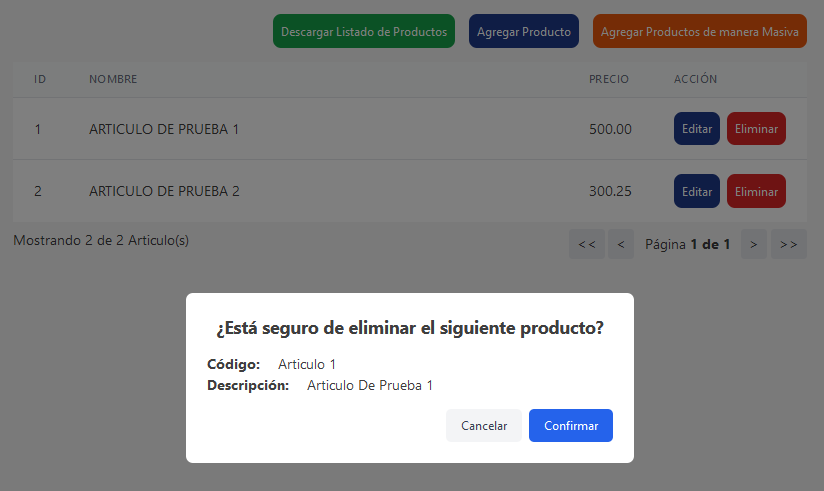
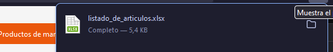
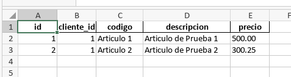
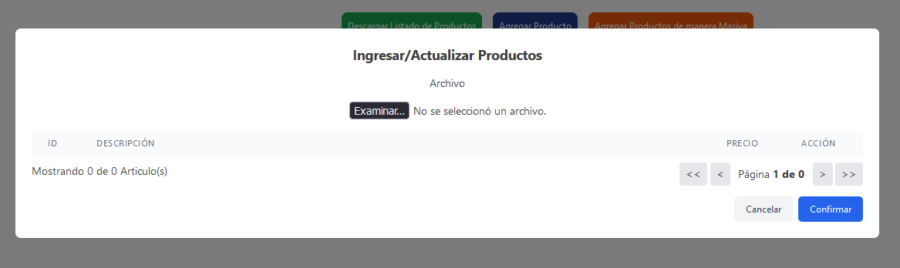
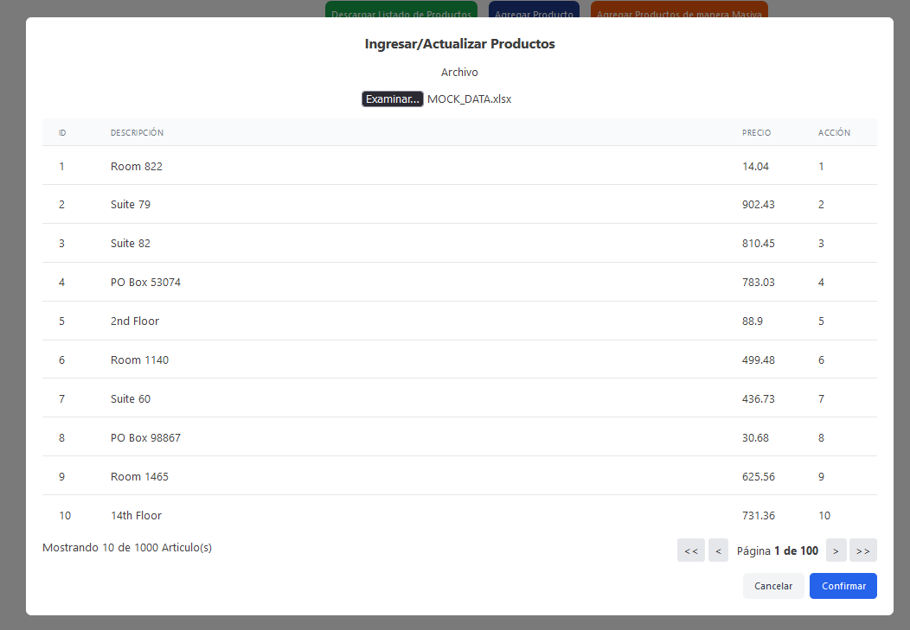
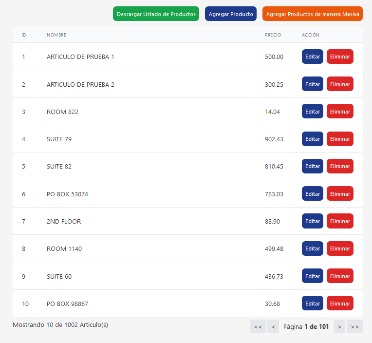
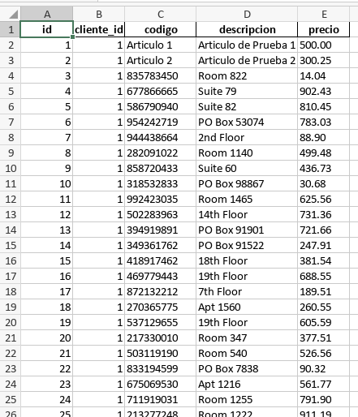

# Desafio Tecnico AIT

#### Descripcion de lo solicitado

_Desarrollar una aplicación web para gestionar "Artículos", que permita a los usuarios crear, listar, actualizar y eliminar artículos.
Los artículos deben tener obligatoriamente un código, una descripción y un precio.
Se debe poder manejar la carga y edición de artículos mediante un archivo Excel y permitir la descarga de la lista de artículos en formato Excel._

#### Tecnologias utilizadas

-   Python 3.12
-   Django 4.2.6
-   Django Rest Framework 3.14.0
-   React 18.3

#### Estructura de directorios

-   backend: contiene el codigo de la api
-   frontend: contiene el codigo de la interfaz web
-   docker-compose.yml: contiene la configuracion de docker con los servicios.

#### Suposiciones y decisiones de diseño

-   La interfaz web no permite el alta de nuevos clientes. Se genera uno cuando se levantan los servicios junto a 2 articulos de prueba.
-   Las credenciales del usuario son (como no podia ser de otra manera...):
    -   Usuario: `admin`
    -   Password: `admin`

_Igualmente, se emula la llamada a la api con el usuario y password anteriores. La api, en este caso, devuelve el primer cliente de la base de datos._

-   El codigo del articulo es unico para cada cliente, pudiendo repetirse entre los clientes pero no para un mismo cliente. Es decir la combinacionn de codigo y cliente es unica.
-   Las pruebas se realizan con `pytest` para la api y `jest` para los componentes del frontend.
-   En la raiz del proyecto se encuentra un archivo xlsx con articulos de prueba.
-   El archivo excel a cargar por parte del usuario unicamente tiene como obligatorios los codigos, descripcion y precios de los articulos. Esto es por si el usuario utiliza un archivo propio para cargar.
-   Del archivo excel, se graban los que no existan y actualiza los que si. Esto es debido a que se considera que el usuario, muy probablemente, utilice el archivo excel descargado para modificarlo y volver a cargarlo.

#### Instalacion

-   Clonar el repositorio

```sh
git clone https://github.com/ferreyra-mg/ait-desafio-tecnico.git
```

-   Ejecutar el comando

```sh
docker-compose up --build
```

Esto levantara los servicios de la api y la interfaz web. La interfaz web se levantara en el puerto 3000 y la api en el puerto 8000.

-   Abrir el navegador y acceder a la url http://localhost:3000/
-   En la interfaz web se puede crear, listar, actualizar y eliminar artículos.
-   Se puede descargar la lista de artículos en formato Excel.

#### ABM de artículos






#### Descarga de la lista de artículos en formato Excel






#### Carga de artículos desde un archivo Excel






